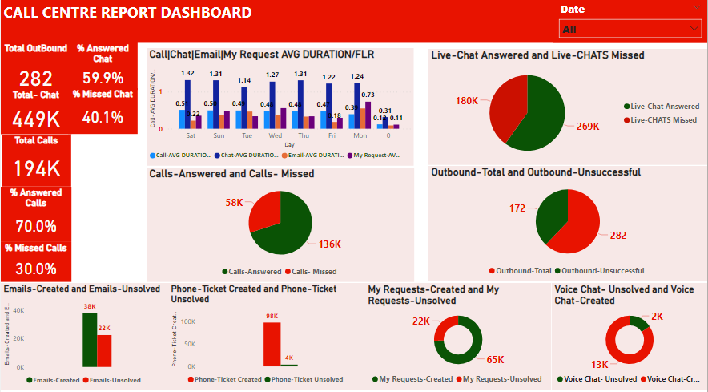
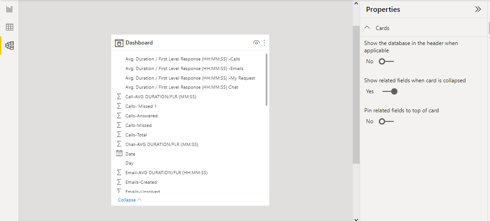

### Call-Center-Report-Dashboard

## Introduction
This project is a Call Center Report Dashboard created using Power BI, a business analytics service by Microsoft. 
The dashboard provides an overview of call center performance metrics and allows users to drill down into detailed information on individual metrics.
## Project Overview
The Call Center Report Dashboard is designed to help managers and analysts monitor and analyze the performance of the call center operations. 
The dashboard includes a range of metrics, including call volume, call duration,chat volume,and chat duration and more  for a month. 
The dashboard also provides insights into various channel through which customer concerns were handle and resolved.
# Features
- Interactive visuals that allow users to explore and analyze call center performance data
- Drill-down functionality that enables users to focus on specific metrics and timeframes
- Real-time updates of key metrics, providing up-to-the-minute insights into call center operations

## How to Use
The Call Center Report Dashboard is easy to use and can be customized to suit your needs. 
To get started, simply open the dashboard in Power BI and explore the available metrics and visualizations. 
You can filter the data by specific timeframes, or other criteria to focus on specific areas of interest.

## Key Channels Visulized
- Average Handling Time/ Firt Level Response
- Calls (Totals,Missed and Answered)
- Chats (Totals,Missed and Answered)
- Outbound(Total and Unsuccessful)
- Emails (Create and Resolved)
- My Request (Created and Unsolved)
- Voice Chat (Created and Unsolved)

## Model
The data model was automacally derived as it was a single table with no connection or relationship with any other table

## Data Source and Transformation
Data was extracted from Google sheet and proper transformation were made through Power Query.
Link to Data Source [Here](https://docs.google.com/spreadsheets/d/1ocZ7_ePzIys8bbMDMn4toEowcAA1oV-vwA-S-HxXeO8/edit#gid=1880035563)

## Findings from analysis on Calls and Chat Channel
- Chat channel recorded Higher Average Handling time
- Averege Handling Time was Higher on Chat Channel on Saturdays
- Calls recorded Lower Average Handling time
- Lowest Average Handling time was recorded on call on Mondays
- Highest Missed Chat were recorded on Sunday 
- Highest Missed Calls were recorded on Wednesdays 
- Highest Answered Chat was recorded on Sundays
- Highest Answered Calls was recorded on Mondays

## *To Interact with the report click* [here](https://app.powerbi.com/groups/me/reports/0da3a6c4-9d0c-404a-aa56-64e33b138d0f/ReportSectionbb321e7dd932de97b11b?clientSideAuth=0)

